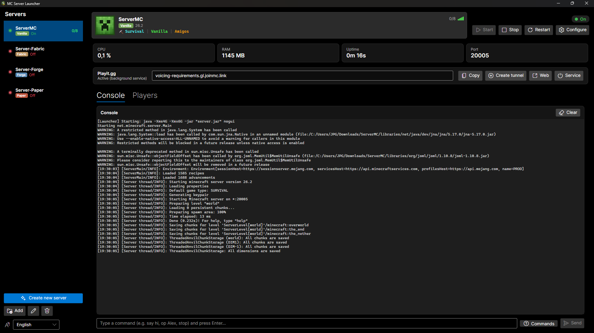
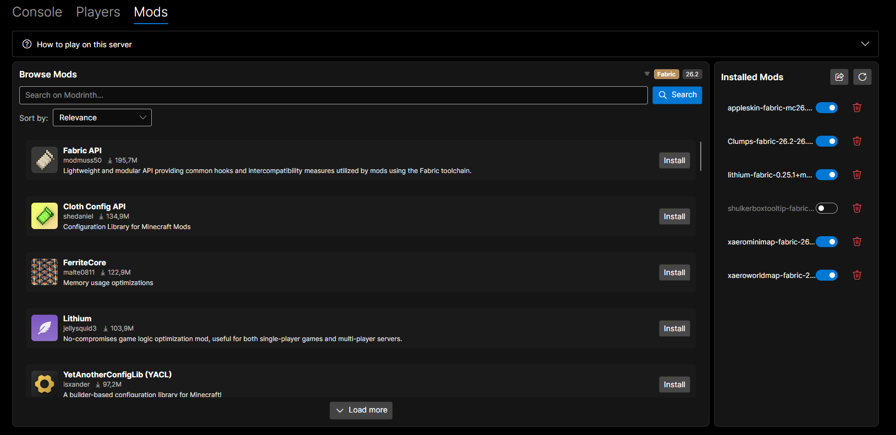
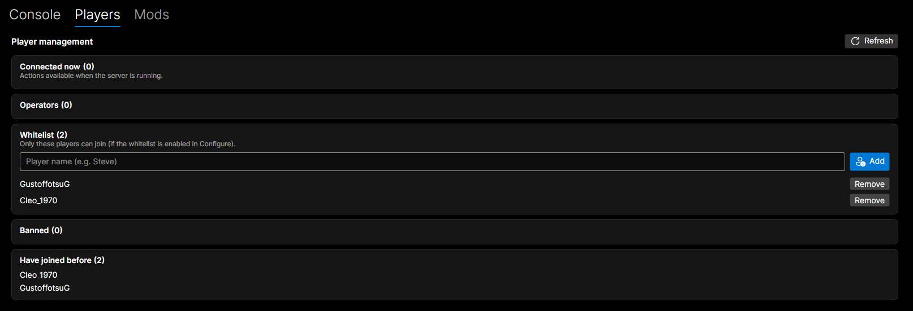
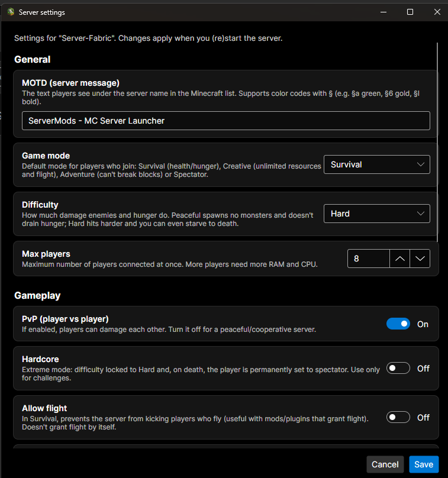

# 🎮 MC Server Launcher

**🇬🇧 [English](README.md) · 🇪🇸 Español**

Aplicación de escritorio para **Windows** (y Linux) para gestionar uno o varios servidores de **Minecraft**
desde una interfaz gráfica moderna — **sin archivos `.bat`, ventanas de consola negras ni editar
configuraciones a mano**.

Crea un servidor, elige el **tipo** (Vanilla, Fabric, Forge o Paper) y la versión, añade **mods o plugins**
con un par de clics, ábrelo a Internet con Playit.gg, gestiona jugadores y ajusta la configuración…
todo con botones.

> Hecha con **Avalonia / .NET 9** — multiplataforma, diseño Fluent, tema oscuro.

## 📸 Un vistazo por dentro

**Lista de servidores, consola en vivo y estadísticas — cada servidor etiquetado con su tipo**



**Buscador de mods y plugins — busca en Modrinth ya filtrado por el tipo y la versión de tu servidor**



**Gestión de jugadores (lista blanca, operadores, baneos…)**



**Editor visual de `server.properties` — cada ajuste explicado con palabras claras**



## ⬇️ Descargar e instalar

1. Ve a la **[última versión (Releases)](https://github.com/JuanP-G/MC-ServerLauncher/releases/latest)**.
2. Descarga **`MC-ServerLauncher-Setup-x.y.z.exe`** y ejecútalo (crea acceso directo en Escritorio y menú Inicio).
3. Abre la app y crea o añade tu servidor. **No necesitas instalar .NET ni Java** — la app se encarga.
4. Las actualizaciones se hacen **dentro de la app**: cuando hay una versión nueva, un aviso muestra un botón
   **Actualizar**, y una ventana de **Novedades** te cuenta qué ha cambiado.

> La primera vez, Windows puede mostrar un aviso de SmartScreen (app nueva sin firma): pulsa
> *Más información → Ejecutar de todas formas*.

## ✨ Funcionalidades

- **Varios servidores** a la vez, cada uno con su configuración y una **etiqueta de tipo** (Vanilla / Fabric /
  Forge / Paper).
- **Crear un servidor** automáticamente: eliges **tipo**, **versión** (lista oficial de Mojang), **puerto** y
  **RAM**; la app descarga el servidor correcto, acepta el EULA, prepara `run.bat` / `server.properties` e
  instala el **Java** adecuado (Temurin) si hace falta. Vanilla/Fabric/Forge usan **mods**; Paper usa **plugins**.
- **Buscador de mods y plugins** 🧩 — busca en **Modrinth** dentro de la app, ya **filtrado por el tipo y la
  versión de tu servidor** (con chips de tipo y versión para que quede claro). Ordena por relevancia o descargas,
  **Instala** con un clic y **activa/desactiva** o borra lo instalado. Los servidores Paper ven plugins; el
  resto, mods.
- **Cambiar el tipo de un servidor** — convierte uno existente a Fabric/Forge/Paper o de vuelta a Vanilla,
  **conservando el mundo**, con avisos por colores de lo que puede afectar cada cambio.
- **Iniciar / Detener / Reiniciar** con parada limpia que guarda el mundo; detecta y libera un **puerto ocupado**;
  **CPU, RAM, tiempo activo y puerto** en vivo con estado por colores.
- **Vista estilo Minecraft** — icono del servidor, MOTD con colores, `jugadores/máx` y señal de accesibilidad.
- **Consola en tiempo real** con texto copiable, caja de comandos y un panel de **ayuda de comandos**.
- **Jugadores** 👥 — conectados (en vivo), operadores, lista blanca, baneados y conocidos, con acciones OP /
  expulsar / banear / lista blanca.
- **Configuración visual de `server.properties`** con explicaciones claras.
- **Integración con Playit.gg** 🌐 — detecta el servicio en segundo plano, muestra/copia la dirección pública y
  puede crear/eliminar túneles.
- **Multi-idioma** — español, inglés, portugués, francés y alemán.

## 🛠️ Compilar desde el código

```powershell
git clone https://github.com/JuanP-G/MC-ServerLauncher.git
cd MC-ServerLauncher
dotnet run --project McServerLauncher

# Compilación self-contained (sin que instalen nada):
dotnet publish McServerLauncher -c Release -r win-x64 --self-contained
```

## 💻 Compatibilidad

| Plataforma | ¿Funciona? |
|---|---|
| Windows x64 / x86 / ARM64 | ✅ Sí |
| Linux x64 | ✅ Sí (AppImage) |
| macOS | ⚙️ Se compila desde el código (aún sin paquete prehecho) |

## 📖 Documentación y datos

La documentación de desarrollo (arquitectura, guía de contribución y una **referencia de API** completa) se
publica con **DocFX** en **https://juanp-g.github.io/MC-ServerLauncher/**. Los datos por usuario se guardan en
`%APPDATA%\McServerLauncher\` (`servers.json`, `settings.json`, el `java\` que instala la app).

## ⚠️ Aviso

Al usar Minecraft aceptas el [EULA de Minecraft](https://aka.ms/MinecraftEULA). Este proyecto no está afiliado a
Mojang, Microsoft ni Playit.gg.

---

🤖 Desarrollado con ayuda de [Claude Code](https://claude.com/claude-code).
