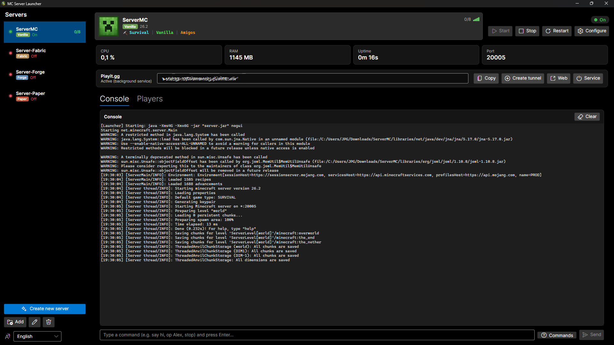
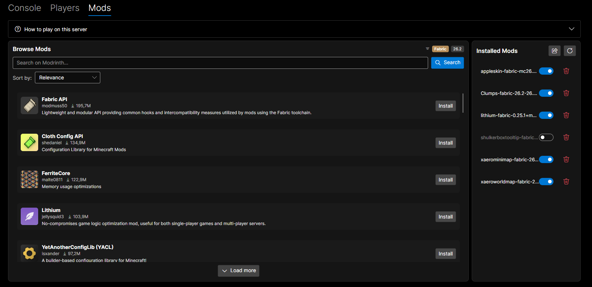
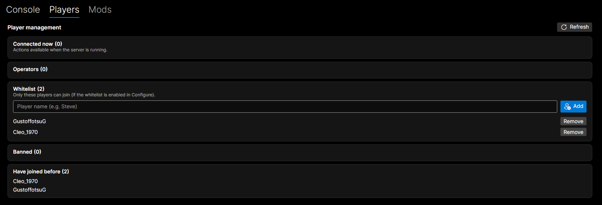
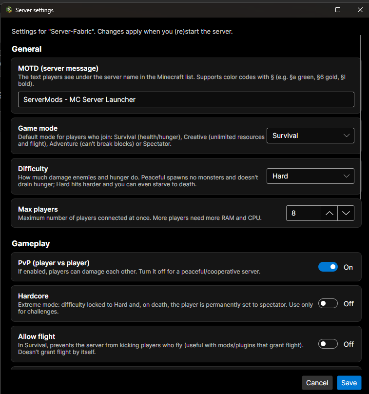

# 🎮 MC Server Launcher

**🇬🇧 [English](README.md) · 🇪🇸 Español**

[](https://mc-server-launcher.vercel.app)
[](https://juanp-g.github.io/MC-ServerLauncher/docs/)
[](https://github.com/JuanP-G/MC-ServerLauncher/releases/latest)
[](LICENSE)

🌐 **[Página web](https://mc-server-launcher.vercel.app)** (también en
[English](https://mc-server-launcher.vercel.app/en/) ·
[Deutsch](https://mc-server-launcher.vercel.app/de/) ·
[Français](https://mc-server-launcher.vercel.app/fr/) ·
[Português](https://mc-server-launcher.vercel.app/pt/)) —
📖 **[Documentación](https://juanp-g.github.io/MC-ServerLauncher/docs/)**

Aplicación de escritorio para **Windows, Linux y macOS** para gestionar uno o varios servidores de
**Minecraft** desde una interfaz gráfica moderna — **sin archivos `.bat`, ventanas de consola negras ni editar
configuraciones a mano**.

Crea un servidor, elige el **tipo** en una rejilla de tarjetas que dice cuáles llevan plugins, cuáles mods y a cuáles
se puede entrar desde Bedrock (Vanilla, Paper, Purpur, Fabric, NeoForge, Forge), elige la versión, añade **mods o plugins**
con un par de clics, ábrelo a Internet con Playit.gg, gestiona jugadores y ajusta la configuración…
todo con botones.

> Hecha con **Avalonia / .NET 9** — multiplataforma, diseño Fluent, tema oscuro.

## 📸 Un vistazo por dentro

**Lista de servidores, consola en vivo y estadísticas — cada servidor etiquetado con su tipo**



**Buscador de mods y plugins — busca en Modrinth ya filtrado por el tipo y la versión de tu servidor**



**Gestión de jugadores (lista blanca, operadores, baneos…)**



**Editor visual de `server.properties` — cada ajuste explicado con palabras claras**



## ⬇️ Descargar e instalar

1. Ve a la **[última versión (Releases)](https://github.com/JuanP-G/MC-ServerLauncher/releases/latest)**.
2. Descarga **`MC-ServerLauncher-Setup-x.y.z.exe`** y ejecútalo (crea acceso directo en Escritorio y menú Inicio).
3. Abre la app y crea o añade tu servidor. **No necesitas instalar .NET ni Java** — la app se encarga.
4. Las actualizaciones se hacen **dentro de la app, en las tres plataformas**: cuando hay una versión nueva,
   un aviso muestra un botón **Actualizar**, y la app la descarga, **la verifica contra su SHA-256 publicado**
   y la instala sola — ejecutando el instalador en Windows, reemplazando el AppImage en Linux y el paquete de
   la app en macOS. Después, una ventana de **Novedades** te cuenta qué ha cambiado.

> La primera vez, Windows puede mostrar un aviso de SmartScreen (app nueva sin firma): pulsa
> *Más información → Ejecutar de todas formas*.
>
> **macOS / Linux:** descarga el `.dmg` (macOS) o el `.AppImage` (Linux) de la misma release. En macOS la app
> aún no está firmada por Apple, así que la primera vez **haz clic derecho en la app → Abrir** para pasar
> Gatekeeper.

## ✨ Funcionalidades

- **Varios servidores** a la vez, cada uno con su configuración y una **etiqueta de tipo** (Vanilla / Fabric /
  Paper / Purpur / Fabric / NeoForge / Forge).
- **Crear un servidor** automáticamente: eliges **tipo**, **versión** (lista oficial de Mojang), **puerto** y
  **RAM**; la app descarga el servidor correcto, acepta el EULA, prepara `run.bat` / `server.properties` e
  instala el **Java** adecuado (Temurin) si hace falta. Fabric, Forge y NeoForge usan **mods**; Paper y Purpur usan **plugins**.
- **Tienda de mods y plugins** 🧩 — busca en **Modrinth** dentro de la app, ya **filtrado por el tipo y la
  versión de tu servidor** (con chips de tipo y versión para que quede claro). Cada resultado trae un **resumen
  en lenguaje claro y en tu idioma** de para qué sirve, y avisa cuando además hay que instalarlo en el cliente.
  Abre la **ficha completa** con galería, versiones, dependencias, enlaces y mods relacionados sin salir de la
  app. Un **panel de Filtros** combina varias categorías a la vez y muestra las aplicadas como chips que puedes
  quitar de una en una. **Instala** con un clic y **activa/desactiva** o borra lo instalado. Paper y Purpur
  ven plugins; los cargadores de mods ven mods.
- **Instalar un mod trae lo que necesita** — las librerías de las que depende (Fabric API, cristallib y
  compañía) se resuelven en Modrinth y se instalan con él, también las de sus dependencias. Es lo que
  reclamaba el cargador de Fabric cuando se negaba a arrancar con una lista de dependencias que faltaban. Solo
  las *obligatorias*, nunca los extras opcionales, y nunca una segunda copia de algo que ya está. Para los
  servidores creados antes, el botón de **buscar actualizaciones** ahora dice además qué librerías faltan y
  ofrece instalarlas.
- **Jugar también desde Bedrock** 📱 — una casilla instala Geyser y Floodgate, elige un puerto UDP libre, crea el
  segundo túnel (UDP) que Bedrock necesita y configura el puerto público que Geyser debe anunciar — la parte que
  casi nadie acierta a mano. Lo bien que funciona depende del tipo de servidor, y la tarjeta de cada tipo lo dice
  antes de que elijas:

  | Tipo | Desde Bedrock | Por qué |
  |---|---|---|
  | **Paper**, **Purpur** | ✅ Funciona | Los plugins solo corren en el servidor: el cliente de Bedrock no necesita nada. |
  | **Fabric** | ✅ Funciona | Con la casilla de contenido de mods: Hydraulic convierte lo que añaden los mods. |
  | **NeoForge** | ⚠️ A veces | Conecta y autentica, y a partir de ahí depende de los mods: cualquiera que el cliente necesite tener deja fuera a Bedrock, y Hydraulic ya no publica para NeoForge. |
  | **Vanilla**, **Forge** | ❌ No | Geyser no publica ninguna versión para ellos. |
- **Que los de Bedrock vean el contenido de los mods** — en **Fabric**, otra casilla instala
  Hydraulic (de los propios GeyserMC) y Fabric API, y los bloques y objetos que añaden los mods se
  convierten para los clientes de Bedrock. Solo en Fabric: Hydraulic dejó de publicar para NeoForge
  en febrero de 2026. Sus autores lo consideran de desarrollo muy temprano, y la app lo dice antes
  de que marques la casilla.
- **Jugar desde otras versiones de Minecraft** — una casilla instala ViaVersion y ViaBackwards, para que entren
  clientes más nuevos y más antiguos que el servidor. Solo en servidores de plugins.
- **Cambiar el tipo de un servidor** — convierte uno existente a Paper/Purpur/Fabric/Forge/NeoForge o de vuelta a Vanilla,
  **conservando el mundo**, con avisos por colores de lo que puede afectar cada cambio.
- **Iniciar / Detener / Reiniciar** con parada limpia que guarda el mundo; detecta y libera un **puerto ocupado**;
  **CPU, RAM, tiempo activo y puerto** en vivo con estado por colores.
- **Vista estilo Minecraft** — icono del servidor, MOTD con colores, `jugadores/máx` y señal de accesibilidad.
- **Consola en tiempo real** con texto copiable, caja de comandos y un panel de **ayuda de comandos**.
- **Jugadores** 👥 — conectados (en vivo), operadores, lista blanca, baneados y conocidos, con acciones OP /
  expulsar / banear / lista blanca.
- **Configuración visual de `server.properties`** con explicaciones claras.
- **Se apaga y se enciende solo** 💤 — un servidor puede **apagarse solo a los N minutos sin nadie dentro** y
  **volver a encenderse cuando alguien intenta entrar**. Mientras duerme, la app responde en el puerto del
  servidor: en la lista se ve *«Apagado · entra para encenderlo»*, y quien pulse Entrar recibe un mensaje
  mientras arranca. La ventana muestra una **cuenta atrás** hasta el apagado, y un servidor recién despertado
  tiene un margen para que no se apague antes de que dé tiempo a entrar. Las dos mitades son **por servidor y
  vienen desactivadas**.
- **Copias de seguridad del mundo** 💾 — una copia antes de cada arranque y en cada parada, con el número de
  copias que quieras conservar, más **copia ahora** y **restaurar** con un clic desde la app.
- **No estorba** — puedes minimizar y/o cerrar **a la bandeja del sistema** para que tus servidores sigan
  funcionando sin la ventana en medio. Y si vuelves a abrir la app, recupera esa ventana en lugar de abrir una
  segunda copia sobre los mismos servidores.
- **Abre tu servidor a Internet con Playit.gg** 🌐 — conecta tu cuenta pegando un **código de configuración**
  de un solo uso (sin claves ni archivos). La app **crea el túnel y ejecuta el agente de Playit por ti**, así
  tu servidor es accesible desde cualquier sitio y tus amigos entran con la dirección pública — **tú no instalas
  nada**. La app no contiene ningún secreto propio (la credencial vive en un pequeño proxy).
- **Notificaciones** 🔔 — avisos opcionales cuando un jugador entra o sale, alguien muere (PvP), el servidor
  se cae, el reinicio automático se rinde, un **servidor vacío se apaga solo** o uno **se enciende porque
  alguien ha intentado entrar**. Configurables por tipo, de forma global y **por servidor**, con botón de
  prueba.
- **Ajustes en un solo sitio** ⚙️ — idioma, notificaciones, comportamiento de la bandeja, tu conexión de
  Playit y un botón de **añadir al escritorio**, todo en un único diálogo.
- **Multi-idioma** — español, inglés, portugués, francés y alemán.

## 🛠️ Compilar desde el código

```powershell
git clone https://github.com/JuanP-G/MC-ServerLauncher.git
cd MC-ServerLauncher
dotnet run --project McServerLauncher

# Compilación self-contained (sin que instalen nada):
dotnet publish McServerLauncher -c Release -r win-x64 --self-contained
```

## 💻 Compatibilidad

| Plataforma | ¿Funciona? |
|---|---|
| Windows x64 | ✅ Sí (instalador `.exe`) |
| Windows ARM64 | ✅ Sí, por emulación x64 (aún sin build nativo) |
| Linux x64 | ✅ Sí (AppImage) |
| macOS (Apple Silicon e Intel) | ✅ Sí (DMG) |

> El instalador de Windows que se publica es **solo x64** (Inno Setup
> `ArchitecturesAllowed=x64compatible`); no hay un build aparte x86 ni ARM64 nativo.

## 📖 Documentación y datos

La documentación de desarrollo (arquitectura, guía de contribución y una **referencia de API** completa) se
publica con **DocFX** en **https://juanp-g.github.io/MC-ServerLauncher/docs/**. Los datos por usuario se guardan en
`%APPDATA%\McServerLauncher\` (`~/.config/McServerLauncher/` en Linux y macOS): `servers.json`,
`settings.json`, el `java\` que instala la app, los `logs\` de consola persistentes (se guardan 14 días),
el `instance.lock` que mantiene una sola copia de la app abierta y, en Linux/macOS, `.secret.key`. Además, la
carpeta de cada servidor tiene un directorio `backups\` con las copias automáticas del mundo.

## 📄 Licencia

Publicado bajo la **[licencia MIT](LICENSE)**: puedes usarlo, modificarlo y redistribuirlo, incluso
con fines comerciales, siempre que mantengas el aviso de copyright. Se ofrece tal cual, sin garantías.

La licencia cubre el código de este proyecto; en [NOTICE](NOTICE) están las notas del software de terceros.
*Minecraft* es una marca de Mojang Studios / Microsoft,
y este proyecto no está afiliado a ellos ni cuenta con su respaldo. Los archivos del servidor de
Minecraft, los entornos de Java, los mods y el agente de Playit.gg que descarga la aplicación
pertenecen a sus respectivos dueños y mantienen sus propias licencias.
