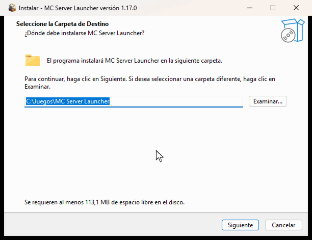
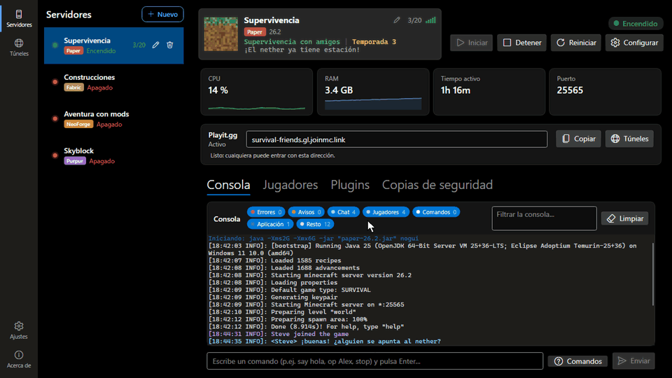
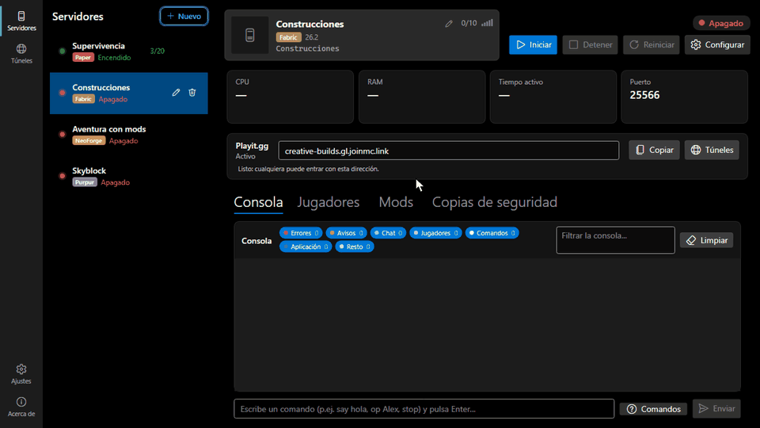
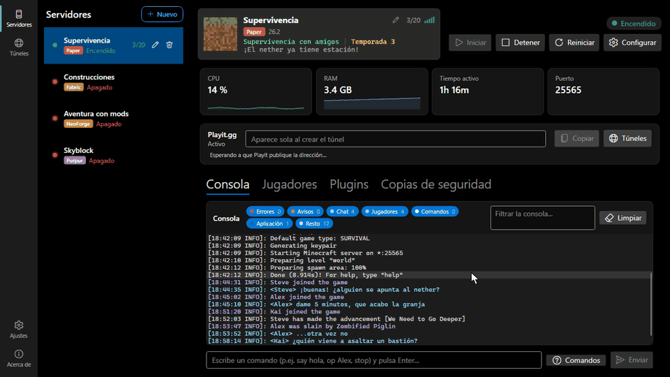
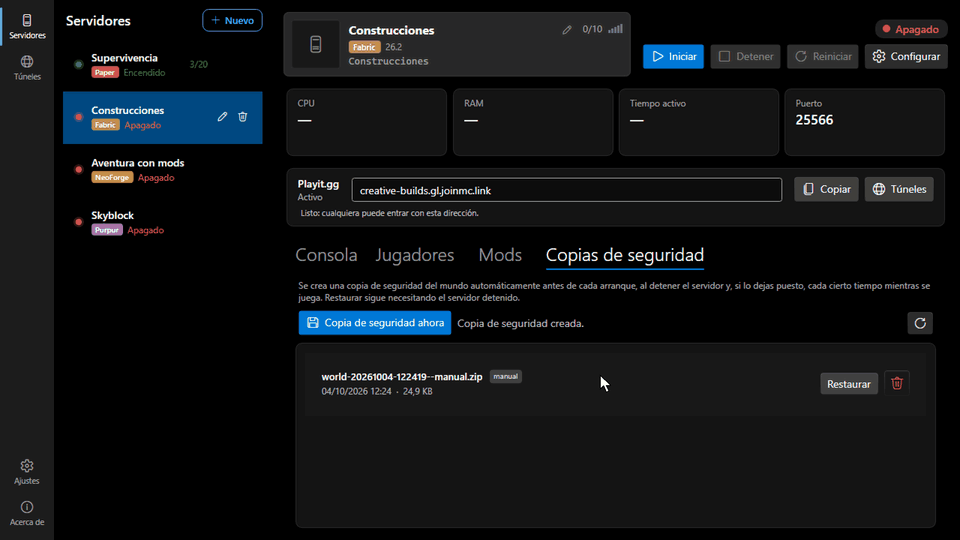
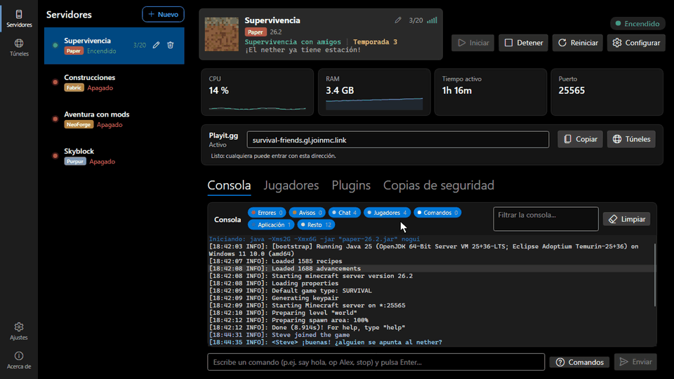

# 🎮 MC Server Launcher

**🇬🇧 [English](README.md) · 🇪🇸 Español**

[](https://mc-server-launcher.vercel.app)
[](https://juanp-g.github.io/MC-ServerLauncher/docs/)
[](https://github.com/JuanP-G/MC-ServerLauncher/releases/latest)
[](LICENSE)

Crea, configura y comparte **servidores de Minecraft** en **Windows, Linux y macOS** desde una app — **sin
archivos `.bat`, ventanas de consola ni configuraciones a mano**.

<p align="center">
  
</p>

<p align="center">
  <a href="https://github.com/JuanP-G/MC-ServerLauncher/releases/latest"><b>⬇️ Descargar</b></a> ·
  <a href="https://mc-server-launcher.vercel.app"><b>🌐 Página web</b></a> ·
  <a href="https://juanp-g.github.io/MC-ServerLauncher/docs/"><b>📖 Documentación</b></a>
</p>

## ✨ Qué puedes hacer

<table>
<tr><td width="33%">🧱 <b>Crear un servidor en 2 minutos</b><br>Vanilla, Paper, Purpur, Fabric, NeoForge o Forge. La app pone hasta el Java.</td><td width="33%">🧩 <b>Mods y plugins de Modrinth</b><br>Ya filtrados por tu versión, y cada uno con lo que necesita.</td><td width="33%">🌐 <b>Jugar con amigos por Internet</b><br>Túnel de Playit.gg: una dirección, sin abrir puertos.</td></tr>
<tr><td width="33%">📱 <b>Desde Bedrock también</b><br>Móvil, consola y Windows 10/11, con una casilla.</td><td width="33%">👥 <b>Jugadores con ficha</b><br>OPs, baneos, lista blanca e historial de cada jugador.</td><td width="33%">💾 <b>Copias del mundo</b><br>Al arrancar, al parar y cada hora mientras se juega.</td></tr>
<tr><td width="33%">💤 <b>Se duerme y se despierta</b><br>Se apaga sin nadie dentro y arranca cuando alguien entra.</td><td width="33%">🖥️ <b>Una consola que se lee</b><br>Colores por tipo de línea, filtros con contador y buscador.</td><td width="33%">🔄 <b>Se actualiza sola</b><br>Cada descarga, comprobada con su SHA-256.</td></tr>
</table>

Todo en **una sola ventana**, en español, inglés, portugués, francés y alemán.

## 🎬 Cómo se hace

Pulsa cada apartado para verlo en marcha.

<details>
<summary><b>⬇️ Instalar la app</b></summary>

<br>

1. Descarga **`MC-ServerLauncher-Setup-x.y.z.exe`** de la **[última versión](https://github.com/JuanP-G/MC-ServerLauncher/releases/latest)**.
2. Ábrelo y pulsa **Siguiente** hasta **Finalizar**. Crea el acceso directo del escritorio y del menú Inicio.
3. Abre la app. **No necesitas instalar .NET ni Java**: la app se encarga.



> La primera vez, Windows puede mostrar un aviso de SmartScreen (app nueva sin firma): pulsa
> *Más información → Ejecutar de todas formas*.
>
> **Linux:** descarga el `.AppImage` de la misma versión. **macOS:** el `.dmg`; como aún no está firmada por
> Apple, la primera vez **clic derecho en la app → Abrir**.

</details>

<details>
<summary><b>🧱 Crear un servidor</b></summary>

<br>

**«+ Nuevo»** → **Crear uno nuevo** → un nombre, el tipo y la versión → marca **Acepto el EULA de Minecraft** →
**Crear servidor**. La app descarga el servidor oficial, comprueba su huella, prepara el puerto y lo arranca.



¿Ya tienes uno? **Añadir uno que ya tengo** reconoce la carpeta (tipo, versión, puerto y memoria) y no cambia
nada en ella.

</details>

<details>
<summary><b>🧩 Instalar mods o plugins</b></summary>

<br>

En la pestaña **Mods** (o **Plugins**), busca, pulsa **Instalar** y ya está: se descarga la versión que encaja
con tu servidor, con las librerías que necesite.



</details>

<details>
<summary><b>🌐 Jugar con amigos por Internet</b></summary>

<br>

Con Playit.gg activado, la dirección pública **aparece sola** a los pocos segundos; pulsa **Copiar** y pásasela a
tus amigos. **Túneles** enseña todos los túneles de tu cuenta y arregla los que sobran.



</details>

<details>
<summary><b>💾 Hacer y restaurar copias</b></summary>

<br>

Las copias automáticas se hacen solas. Para una a mano, **Copia de seguridad ahora** en la pestaña **Copias de
seguridad**; **Restaurar** devuelve el mundo a ese momento (con el servidor detenido).



</details>

<details>
<summary><b>🔄 Actualizar la app</b></summary>

<br>

Cuando hay una versión nueva sale un aviso arriba: **Actualizar** la descarga, la comprueba y la instala. Al
volver a abrirse, **Novedades** te cuenta qué ha cambiado. Funciona igual en Windows, Linux y macOS.



</details>

## 📋 Todas las funciones

<details>
<summary><b>🧱 Servidores</b> — crear, añadir, tipos, arrancar, apariencia, semillas, dormir</summary>

<br>

- **Todo en una ventana**: un menú lateral con **Servidores**, **Túneles**, **Ajustes** y **Acerca de**. Crear o
  añadir un servidor se hace junto a la lista, y se puede dejar a medias y retomar.
- **Varios servidores** a la vez, cada uno con su configuración y una **etiqueta de tipo** (Vanilla / Paper /
  Purpur / Fabric / NeoForge / Forge).
- **Crear un servidor** automáticamente: eliges **tipo**, **versión** (lista oficial de Mojang), **puerto** y
  **RAM**, y aceptas el EULA de Minecraft; la app descarga el servidor correcto, prepara `run.bat` / `server.properties` e
  instala el **Java** adecuado (Temurin) si hace falta. Fabric, Forge y NeoForge usan **mods**; Paper y Purpur
  usan **plugins**. El mismo panel puede **usar una carpeta que ya existe**: reconoce el tipo, la versión de
  Minecraft y del loader, el puerto y la memoria, y no cambia nada en la carpeta.
- **Cambiar el tipo de un servidor** — a Paper/Purpur/Fabric/Forge/NeoForge o de vuelta a Vanilla,
  **conservando el mundo**, con avisos por colores de lo que puede afectar cada cambio.
- **Iniciar / Detener / Reiniciar** con parada limpia que guarda el mundo; detecta y libera un **puerto
  ocupado**; **CPU, RAM, tiempo activo y puerto** en vivo.
- **Tarjeta estilo Minecraft** — icono, MOTD con colores, `jugadores/máx` y señal. Pulsa la imagen o el lápiz
  para abrir **Apariencia del servidor**: la imagen, el nombre y las dos líneas del MOTD —colores, negrita,
  cursiva, subrayado y tachado— con la propia tarjeta como vista previa.
- **Configuración visual de `server.properties`** con explicaciones claras.
- **Semillas** 🌱 — elígela al crear el servidor, mira la real en su configuración y ábrela en el mapa de
  Chunkbase, en la versión de ese servidor, con un clic.
- **Se apaga y se enciende solo** 💤 — un servidor puede **apagarse a los N minutos sin nadie dentro** y
  **volver a encenderse cuando alguien intenta entrar**. Mientras duerme, la lista dice *«Apagado · entra para
  encenderlo»* y quien pulse Entrar recibe un mensaje mientras arranca. Hay **cuenta atrás** hasta el apagado y
  un margen tras despertar. Si el servidor tiene lista blanca, solo la despiertan sus jugadores (u ops), no un
  escáner de Internet. Por servidor y **desactivado de serie**.
- **Antes de arrancar se comprueba que no falte nada** ✅ — si a un mod o plugin le falta una dependencia, se
  avisa **al darle a Iniciar**, con la opción de instalarla y arrancar. Se lee de los propios jars, así que
  funciona **sin conexión**. Para mods de Fabric y Forge/NeoForge y plugins de Paper y Purpur.

</details>

<details>
<summary><b>🧩 Mods y plugins</b> — tienda, dependencias, actualizaciones, modpack para tus amigos</summary>

<br>

- **Tienda de mods y plugins** — busca en **Modrinth** dentro de la app, ya **filtrado por el tipo y la
  versión de tu servidor**. Cada resultado trae un **resumen en lenguaje claro y en tu idioma**, y avisa cuando
  además hay que instalarlo en el cliente. La **ficha completa** (galería, versiones, dependencias, enlaces y
  mods relacionados) se abre sin salir de la app, y el **panel de Filtros** combina varias categorías.
  **Instala** con un clic y **activa/desactiva** o borra lo instalado; lo instalado tiene su propio buscador.
- **Instalar un mod trae lo que necesita** — las librerías de las que depende (Fabric API y compañía) se
  instalan con él, también las de sus dependencias. Solo las *obligatorias*, y nunca una segunda copia.
- **Actualizaciones** — **buscar actualizaciones** dice qué hay nuevo y qué librerías faltan; se actualiza de
  uno en uno o con **Actualizar todas**.
- **Manda a tus amigos un modpack listo** 📦 — un botón comprime los mods con instrucciones en su idioma. Los
  que solo hacen algo en el servidor (Geyser, Floodgate, un mod de copias) **se dejan fuera solos**, y la app
  te dice cuáles. El paquete lleva un **script para Windows, Linux y macOS** que encuentra las carpetas de
  mods —incluida cada instancia de Prism, MultiMC, CurseForge o Modrinth App—, lo copia todo y aparta lo que
  hubiera, **sin borrar nada**. Si falta Fabric, Forge o NeoForge, **se ofrece a instalarlo**, comprobando la
  descarga contra el hash publicado por el propio cargador.

</details>

<details>
<summary><b>🌐 Internet, Bedrock y otras versiones</b> — Playit.gg, Túneles, Geyser, ViaVersion</summary>

<br>

- **Abre tu servidor a Internet con Playit.gg** — conecta tu cuenta desde **Túneles** pegando un **código de
  configuración** de un solo uso. La app **crea el túnel y ejecuta el agente de Playit por ti** — **tú no
  instalas nada** — y la dirección **aparece sola** en segundos. La app no contiene ningún secreto propio (la
  credencial vive en un pequeño proxy).
- **Túneles** — todos los túneles de tu cuenta en una tabla: marca los que no llevan a nada, los repetidos y
  los puertos compartidos, con un botón para arreglar cada uno, y deja renombrarlos o borrarlos.
- **Jugar también desde Bedrock** 📱 — una casilla instala Geyser y Floodgate, elige un puerto UDP libre, crea
  el segundo túnel (UDP) y configura el puerto público que Geyser debe anunciar. El puerto de Bedrock se cambia
  en la configuración de cada servidor, y nunca se le da el mismo a dos. Depende del tipo de servidor:

  | Tipo | Desde Bedrock | Por qué |
  |---|---|---|
  | **Paper**, **Purpur** | ✅ Funciona | Los plugins solo corren en el servidor: el cliente de Bedrock no necesita nada. |
  | **Fabric** | ✅ Funciona | Con la casilla de contenido de mods: Hydraulic convierte lo que añaden los mods. |
  | **NeoForge** | ⚠️ A veces | Conecta, pero cualquier mod que el cliente necesite tener deja fuera a Bedrock, y Hydraulic ya no publica para NeoForge. |
  | **Vanilla**, **Forge** | ❌ No | Geyser no publica ninguna versión para ellos. |

- **Que los de Bedrock vean el contenido de los mods** — en **Fabric**, otra casilla instala Hydraulic (de
  GeyserMC) y Fabric API. Sus autores lo consideran de desarrollo muy temprano, y la app lo dice.
- **Jugar desde otras versiones de Minecraft** — una casilla instala ViaVersion y ViaBackwards (solo en
  servidores de plugins).

</details>

<details>
<summary><b>👥 Jugadores, consola y avisos</b> — historial, consola de colores, notificaciones</summary>

<br>

- **Jugadores** — conectados en vivo, operadores, lista blanca y baneados, con botones en vez de comandos.
- **Historial de jugadores** 📜 — todos los que han entrado alguna vez, con su última conexión. Su ficha:
  entradas y salidas, chat, muertes y logros, tiempo jugado, bloques minados y objetos usados —con su
  porcentaje— y curiosidades (saltos, daño, lo recorrido a pie, volando y con elytra). Se rellena la primera vez
  con los logs antiguos, ocupa poco (500 eventos y 90 días por jugador de serie) y se queda en tu equipo. **La IP
  no se guarda nunca.**
- **Consola legible** 🖥️ — cada línea con su color (errores, avisos, chat, entradas y salidas, comandos, y lo
  que dice la app aparte de lo que dice el servidor), **un filtro por categoría con su contador** y lo que
  buscas **marcado dentro de la línea**. La app **resuelve los avisos de arranque que le tocan**: activa el
  acceso nativo en Java 22+ y pregunta una vez si aceptas la descarga de BlueMap. Con caja de comandos y un
  panel de **ayuda de comandos**.
- **Notificaciones** 🔔 — cuando un jugador entra o sale, alguien muere (PvP), el servidor se cae, el reinicio
  automático se rinde, o un servidor se apaga o se enciende solo. Por tipo, de forma global y **por servidor**.
- **Cada aviso se distingue de un vistazo** 🎨 — un color y un emoji por tipo. Los colores se cambian en
  Ajustes, de una paleta pensada para el fondo oscuro o con el selector completo, que avisa si van a costar leerse.

</details>

<details>
<summary><b>💾 Copias, ajustes y comodidad</b></summary>

<br>

- **Copias de seguridad del mundo** — antes de cada arranque, en cada parada y, si lo dejas puesto, cada hora
  mientras se juega. Para copiar un servidor arrancado se le pide antes a Minecraft que vuelque el mundo a
  disco, así que la copia nunca queda a medias; y si nadie se ha conectado desde la anterior, se salta. Las que
  haces a mano se cuentan aparte, así que el reloj nunca las borra. **Copia ahora** y **Restaurar** con un clic.
- **Ajustes dentro de la ventana** ⚙️ — idioma, bandeja del sistema, **añadir al escritorio**, notificaciones,
  colores e historial de jugadores, cada cosa en su página. Se guarda al momento.
- **No estorba** — minimiza o cierra **a la bandeja** y tus servidores siguen; abrir la app otra vez recupera
  esa ventana en vez de abrir una segunda copia.
- **Se actualiza sola en las tres plataformas** — la descarga se **verifica contra su SHA-256 publicado** antes
  de instalarla, y después **Novedades** cuenta qué ha cambiado.
- **Multi-idioma** — español, inglés, portugués, francés y alemán.

</details>

## 📸 Capturas

<details>
<summary><b>Ver las capturas</b></summary>

<br>

**La ventana: menú lateral, lista de servidores y uno arrancado**


**Nuevo servidor, dentro de la ventana**


**Buscador de mods y plugins**


**Gestión de jugadores**


**Editor visual de `server.properties`**


</details>

## 💻 Compatibilidad

| Windows x64 | Windows ARM64 | Linux x64 | macOS (Apple Silicon e Intel) |
|---|---|---|---|
| ✅ Instalador `.exe` | ✅ Por emulación x64 | ✅ AppImage | ✅ DMG |

## 🛠️ Para desarrolladores

<details>
<summary><b>Compilar, documentación, datos y contribuir</b></summary>

<br>

```powershell
git clone https://github.com/JuanP-G/MC-ServerLauncher.git
cd MC-ServerLauncher
dotnet run --project McServerLauncher

# Compilación self-contained (sin que instalen nada):
dotnet publish McServerLauncher -c Release -r win-x64 --self-contained
```

Hecha con **Avalonia / .NET 9**. El instalador de Windows es **solo x64** (Inno Setup
`ArchitecturesAllowed=x64compatible`); no hay build aparte x86 ni ARM64 nativo.

**Documentación:** arquitectura, guía de contribución y la **referencia de API**, publicadas con DocFX en
**https://juanp-g.github.io/MC-ServerLauncher/docs/**.

**Datos:** en `%APPDATA%\McServerLauncher\` (`~/.config/McServerLauncher/` en Linux y macOS): `servers.json`,
`settings.json`, el `java\` que instala la app, los `logs\` de consola (14 días, 50 MB al día como mucho), la `cache\` de la tienda, el
agente en `playit-agent\`, el `instance.lock` que mantiene una sola copia abierta y, en Linux/macOS,
`.secret.key`. Cada servidor guarda sus copias en su carpeta `backups\`.

**Flags de Java extra:** la app no tiene un campo para ellos, pero cada servidor de `servers.json` tiene
una entrada `ExtraJvmArgs` (vacía por defecto) que se añade a la línea de comandos de Java tras
`-Xms`/`-Xmx`, para flags como los de Aikar. Edítala con la app cerrada, porque la app reescribe el
fichero mientras funciona.

**Contribuir:** los pull requests son bienvenidos. Empieza por **[CONTRIBUTING.md](CONTRIBUTING.md)**, la
versión corta de la [guía completa](https://juanp-g.github.io/MC-ServerLauncher/docs/articles/contributing.es.html):
cómo compilar y probar, el estilo de código y la regla de que la documentación se mueve con el código, en los
dos idiomas.

</details>

## 📄 Licencia

**[MIT](LICENSE)**: úsalo, modifícalo y redistribúyelo, incluso con fines comerciales, manteniendo el aviso de
copyright. Se ofrece tal cual, sin garantías. El software de terceros está en [NOTICE](NOTICE).

*Minecraft* es una marca de Mojang Studios / Microsoft; este proyecto no está afiliado a ellos ni cuenta con su
respaldo. Los archivos del servidor, los entornos de Java, los mods y el agente de Playit.gg que descarga la
app pertenecen a sus dueños y mantienen sus propias licencias.
