# 🎮 MC Server Launcher

**🇬🇧 English · 🇪🇸 [Español](README.es.md)**

[](https://mc-server-launcher.vercel.app)
[](https://juanp-g.github.io/MC-ServerLauncher/docs/)
[](https://github.com/JuanP-G/MC-ServerLauncher/releases/latest)
[](LICENSE)

Create, configure and share **Minecraft servers** on **Windows, Linux and macOS** from one app — **no `.bat`
files, black console windows or editing config files by hand**.

<p align="center">
  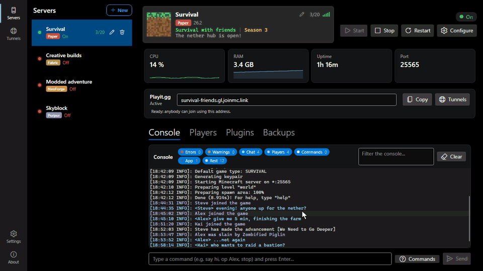
</p>

<p align="center">
  <a href="https://github.com/JuanP-G/MC-ServerLauncher/releases/latest"><b>⬇️ Download</b></a> ·
  <a href="https://mc-server-launcher.vercel.app/en/"><b>🌐 Website</b></a> ·
  <a href="https://juanp-g.github.io/MC-ServerLauncher/docs/"><b>📖 Documentation</b></a>
</p>

## ✨ What you can do

<table>
<tr><td width="33%">🧱 <b>A server in 2 minutes</b><br>Vanilla, Paper, Purpur, Fabric, NeoForge or Forge. The app even brings Java.</td><td width="33%">🧩 <b>Mods and plugins from Modrinth</b><br>Already filtered by your version, each with what it needs.</td><td width="33%">🌐 <b>Play with friends online</b><br>A Playit.gg tunnel: one address, no port forwarding.</td></tr>
<tr><td width="33%">📱 <b>From Bedrock too</b><br>Phone, console and Windows 10/11, with one checkbox.</td><td width="33%">👥 <b>Players with a profile</b><br>Ops, bans, whitelist and every player's history.</td><td width="33%">💾 <b>World backups</b><br>On start, on stop and every hour while people play.</td></tr>
<tr><td width="33%">💤 <b>Sleeps and wakes</b><br>Stops with nobody on and starts when someone joins.</td><td width="33%">🖥️ <b>A console you can read</b><br>Coloured by kind of line, with counted filters and search.</td><td width="33%">🔄 <b>Updates itself</b><br>Every download checked against its SHA-256.</td></tr>
</table>

All in **one window**, in English, Spanish, Portuguese, French and German.

## 🎬 How to

Open each one to see it in action.

<details>
<summary><b>⬇️ Install the app</b></summary>

<br>

1. Download **`MC-ServerLauncher-Setup-x.y.z.exe`** from the **[latest release](https://github.com/JuanP-G/MC-ServerLauncher/releases/latest)**.
2. Run it and click **Next** until **Finish**. It creates a Desktop and a Start-menu shortcut.
3. Open the app. **You don't need to install .NET or Java** — the app handles it.

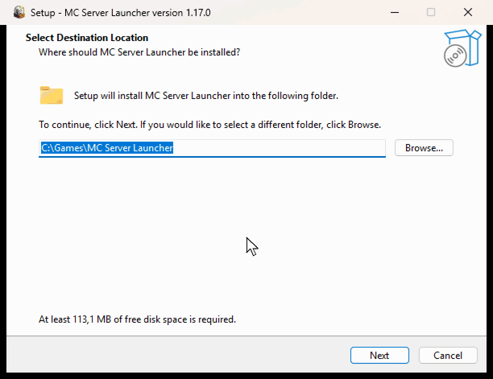

> The first time, Windows SmartScreen may warn (new, unsigned app): click *More info → Run anyway*.
>
> **Linux:** grab the `.AppImage` from the same release. **macOS:** the `.dmg`; it isn't Apple-signed yet, so
> the first time **right-click the app → Open**.

</details>

<details>
<summary><b>🧱 Create a server</b></summary>

<br>

**"+ New"** → **Create a new one** → a name, the type and the version → tick **I accept the Minecraft EULA** →
**Create server**. The app downloads the official server, checks its checksum, sets up the port and starts it.

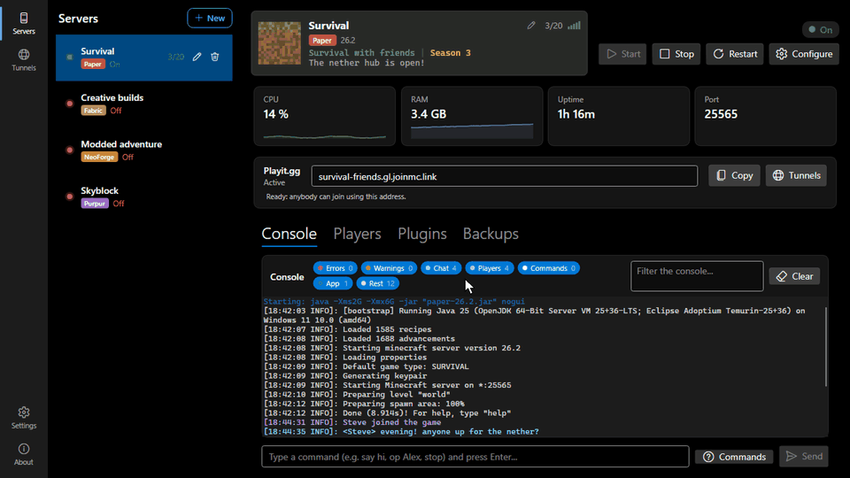

Already have one? **Add one I already have** reads the folder (type, version, port and memory) and changes
nothing in it.

</details>

<details>
<summary><b>🧩 Install mods or plugins</b></summary>

<br>

In the **Mods** (or **Plugins**) tab, search, click **Install** and that's it: the build that fits your server
is downloaded, together with any libraries it needs.

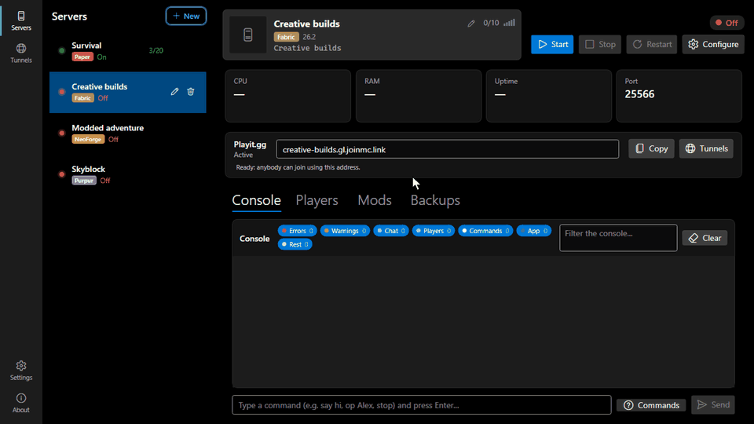

</details>

<details>
<summary><b>🌐 Play with friends over the Internet</b></summary>

<br>

With Playit.gg on, the public address **appears on its own** within seconds; click **Copy** and send it to your
friends. **Tunnels** shows every tunnel on your account and fixes the ones that don't belong.

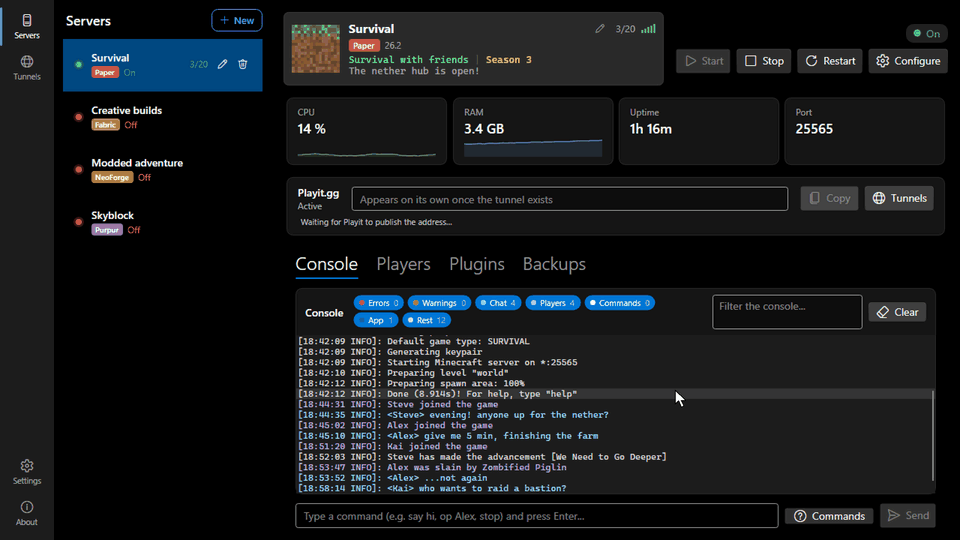

</details>

<details>
<summary><b>💾 Back up and restore</b></summary>

<br>

Automatic backups happen by themselves. For one by hand, **Back up now** in the **Backups** tab; **Restore**
takes the world back to that moment (with the server stopped).

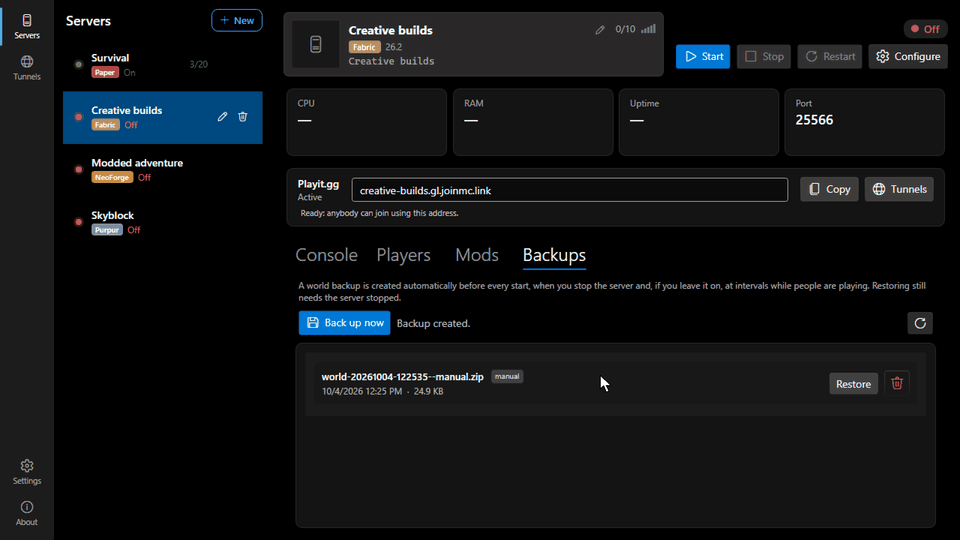

</details>

<details>
<summary><b>🔄 Update the app</b></summary>

<br>

When there's a new version, a banner appears at the top: **Update** downloads it, checks it and installs it.
When it opens again, **What's new** tells you what changed. It works the same on Windows, Linux and macOS.

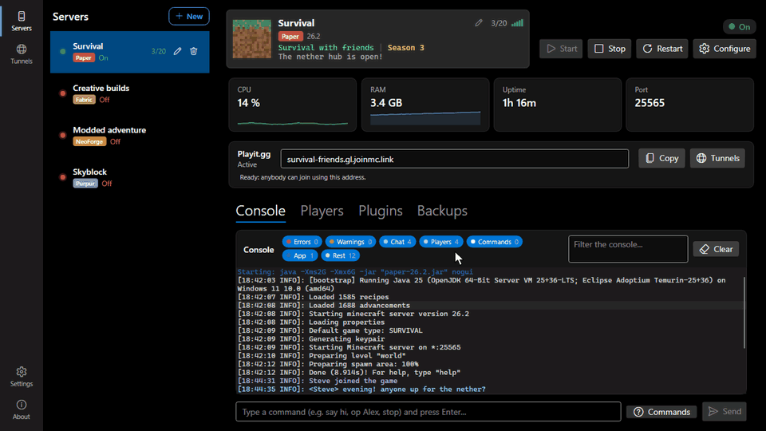

</details>

## 📋 Every feature

<details>
<summary><b>🧱 Servers</b> — create, add, types, start, appearance, seeds, sleep</summary>

<br>

- **Everything in one window** — a side rail with **Servers**, **Tunnels**, **Settings** and **About**. Making
  or adding a server happens next to the list, and can be left half-done and picked up again.
- **Multiple servers** at once, each with its own config and a **type badge** (Vanilla / Paper / Purpur /
  Fabric / NeoForge / Forge).
- **Create a server** automatically: pick the **type**, **version** (official Mojang list), **port** and
  **RAM**, and accept the Minecraft EULA; the app downloads the right server, prepares `run.bat` / `server.properties`, and
  installs the correct **Java** (Temurin) if needed. Fabric, Forge and NeoForge use **mods**; Paper and Purpur
  use **plugins**. The same panel can **use a folder that already exists**: it recognises the type, the
  Minecraft and loader versions, the port and the memory, and changes nothing in the folder.
- **Change a server's type** — to Paper/Purpur/Fabric/Forge/NeoForge or back to Vanilla, **keeping the world**,
  with colour-coded warnings about what each change can affect.
- **Start / Stop / Restart** with a clean stop that saves the world; detects and frees a **busy port**; live
  **CPU, RAM, uptime and port**.
- **Minecraft-style card** — icon, coloured MOTD, `players/max` and a reachability signal. Click the image or
  the pencil for **Server appearance**: the image, the name and both lines of the MOTD — colours, bold,
  italics, underline and strikethrough — with the card itself as the preview.
- **Visual `server.properties` editor** with plain-language explanations.
- **Seeds** 🌱 — choose one when creating a server, see the real one in its configuration, and open it on
  Chunkbase's seed map for that server's version in one click.
- **Sleeps and wakes on its own** 💤 — a server can **stop itself after N minutes with nobody on** and **start
  again when somebody tries to join**. While it sleeps the list shows *"Off · join to start it"* and whoever
  presses Join gets a message while it boots. There's a **countdown** to the shutdown and a grace period after
  waking. If the server has a whitelist, only players on it (or ops) can wake it — an internet scanner can't. Per
  server and **off by default**.
- **Nothing missing before it starts** ✅ — if a mod or plugin is waiting on a dependency, you're told **when
  you press Start**, with the option to install it and start. It's read from the jars themselves, so it works
  **offline**. Covers Fabric and Forge/NeoForge mods, and Paper and Purpur plugins.

</details>

<details>
<summary><b>🧩 Mods and plugins</b> — store, dependencies, updates, a modpack for your friends</summary>

<br>

- **Mods & plugins store** — search **Modrinth** inside the app, already **filtered by your server's type and
  version**. Every result carries a **plain-language summary in your language** and a warning when it also has
  to be installed on the client. The **details page** (gallery, versions, dependencies, links and related mods)
  opens without leaving the app, and the **Filters panel** combines several categories. One-click **Install**,
  and **enable/disable** or delete installed items; the installed list has its own search box.
- **Installing a mod brings what it needs** — the libraries it depends on (Fabric API and the rest) are
  installed with it, transitively. Only *required* ones, and never a second copy.
- **Updates** — **check for updates** says what's new and which libraries are missing; update them one by one
  or with **Update all**.
- **Send your friends a ready-made modpack** 📦 — one button zips the mods with instructions in their language.
  Mods that only do anything on the server (Geyser, Floodgate, a backup mod) are **left out automatically**, and
  the app tells you which. The pack carries a **script for Windows, Linux and macOS** that finds the mods
  folders — including each Prism, MultiMC, CurseForge or Modrinth App instance — copies everything in and moves
  aside what was there, **never deleting a thing**. If Fabric, Forge or NeoForge is missing it **offers to
  install it**, checking the download against the loader's own published hash.

</details>

<details>
<summary><b>🌐 Internet, Bedrock and other versions</b> — Playit.gg, Tunnels, Geyser, ViaVersion</summary>

<br>

- **Share to the Internet with Playit.gg** — connect your account from **Tunnels** by pasting a one-time
  **setup code**. The app **creates the tunnel and runs the Playit agent for you** — **you install nothing** —
  and the address **appears on its own** within seconds. The app ships no secret of its own (the credential
  lives in a small proxy).
- **Tunnels** — every tunnel on your account in one table: it flags the ones that lead nowhere, the duplicates
  and the shared ports, with a button to fix each one, and lets you rename or delete them.
- **Play from Bedrock too** 📱 — one checkbox installs Geyser and Floodgate, picks a free UDP port, creates the
  second (UDP) tunnel and sets the public port Geyser must advertise. The Bedrock port is changed in each
  server's configuration, and two servers are never given the same one. It depends on the server type:

  | Type | From Bedrock | Why |
  |---|---|---|
  | **Paper**, **Purpur** | ✅ Works | Plugins run on the server alone, so a Bedrock client needs nothing. |
  | **Fabric** | ✅ Works | With the mod-content checkbox: Hydraulic converts what the mods add. |
  | **NeoForge** | ⚠️ Sometimes | It connects, but any mod the client is required to have shuts Bedrock out, and Hydraulic no longer publishes for NeoForge. |
  | **Vanilla**, **Forge** | ❌ No | Geyser publishes no build for them. |

- **Bedrock players seeing modded content** — on **Fabric**, one more checkbox installs Hydraulic (GeyserMC's
  own) and Fabric API. Its authors call it very early development, and the app says so.
- **Play from other Minecraft versions** — one checkbox installs ViaVersion and ViaBackwards (plugin servers
  only).

</details>

<details>
<summary><b>👥 Players, console and notifications</b> — history, a coloured console, alerts</summary>

<br>

- **Players** — connected (live), operators, whitelist and banned, with buttons instead of commands.
- **Player history** 📜 — everyone who has ever joined, with their last connection. Their profile: joins and
  leaves, chat, deaths and advancements, time played, blocks broken and items used — each with its share — and
  odds and ends (jumps, damage, distance on foot, flying and by elytra). Filled from the old logs the first
  time, kept small (500 events and 90 days per player by default) and on your computer only. **IP addresses are
  never kept.**
- **A console you can read** 🖥️ — every line coloured for what it is (errors, warnings, chat, joins and leaves,
  commands, and what the app says told apart from what the server says), **a filter per category with its own
  count**, and what you search for **marked inside the line**. The app **answers the start-up warnings that
  are its to answer**: it enables native access on Java 22+ and asks once whether to accept BlueMap's download.
  With a command box and a **command-help** panel.
- **Notifications** 🔔 — when a player joins or leaves, someone dies (PvP), the server crashes, auto-restart
  gives up, or a server stops or starts by itself. Per kind, globally and **per server**.
- **Every notification tells itself apart at a glance** 🎨 — a colour and an emoji per kind. Colours are
  changed in Settings, from a palette made for the dark background or with the full picker, which warns you
  when one would be hard to read.

</details>

<details>
<summary><b>💾 Backups, settings and comfort</b></summary>

<br>

- **Automatic world backups** — before every start, on every stop and, if you leave it on, every hour while
  people are playing. A backup of a running server asks Minecraft to flush the world to disk first, so it is
  never half-written, and one nobody played since is skipped. Backups you take by hand are counted separately,
  so the clock never deletes them. **Back up now** and one-click **Restore**.
- **Settings, part of the window** ⚙️ — language, tray behaviour, **Add to desktop**, notifications, colours
  and the player history, each on its own page. Saved as you go.
- **Stays out of the way** — minimize or close **to the system tray** and your servers keep running; launching
  the app again brings that window back instead of opening a second copy.
- **Updates itself on all three platforms** — the download is **checked against its published SHA-256** before
  it is installed, and **What's new** then tells you what changed.
- **Multi-language** — English, Spanish, Portuguese, French and German.

</details>

## 📸 Screenshots

<details>
<summary><b>See the screenshots</b></summary>

<br>

**The window: side rail, server list and a running server**

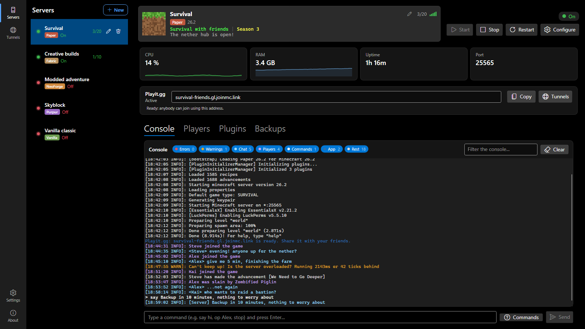

**New server, inside the window**

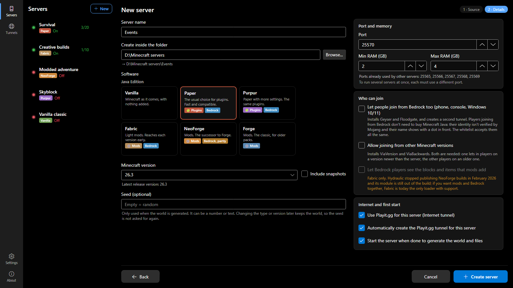

**Mods & plugins browser**

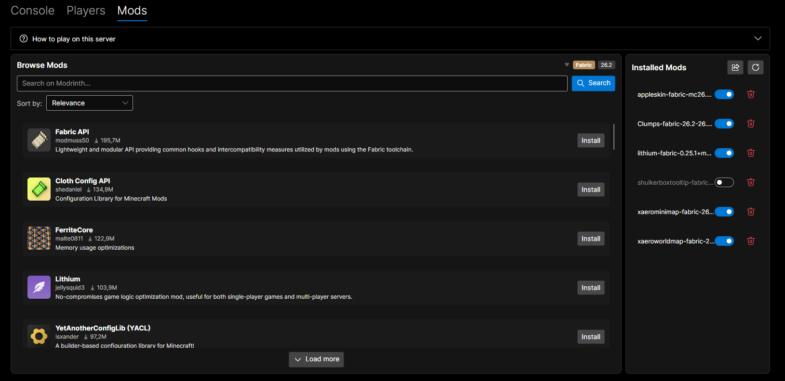

**Player management**

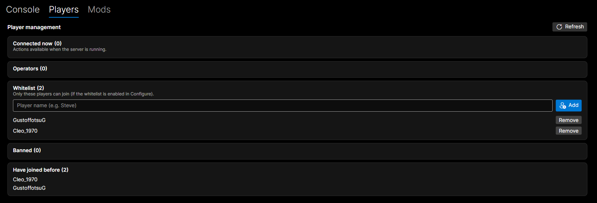

**Visual `server.properties` editor**

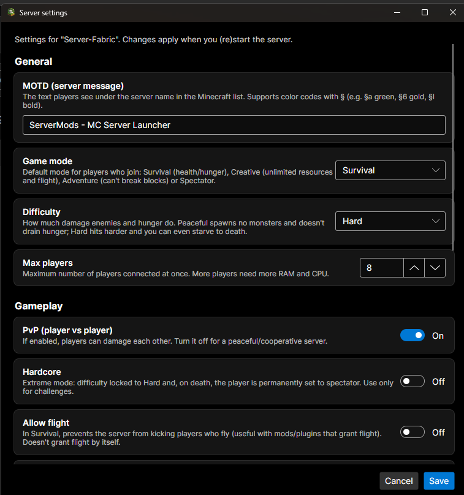

</details>

## 💻 Platform support

| Windows x64 | Windows ARM64 | Linux x64 | macOS (Apple Silicon & Intel) |
|---|---|---|---|
| ✅ `.exe` installer | ✅ Via x64 emulation | ✅ AppImage | ✅ DMG |

## 🛠️ For developers

<details>
<summary><b>Build, documentation, data and contributing</b></summary>

<br>

```powershell
git clone https://github.com/JuanP-G/MC-ServerLauncher.git
cd MC-ServerLauncher
dotnet run --project McServerLauncher

# Self-contained build (users install nothing):
dotnet publish McServerLauncher -c Release -r win-x64 --self-contained
```

Built with **Avalonia / .NET 9**. The Windows installer is **x64 only** (Inno Setup
`ArchitecturesAllowed=x64compatible`); there's no separate x86 or native ARM64 build.

**Documentation:** architecture, contributing guide and a full **API reference**, published with DocFX at
**https://juanp-g.github.io/MC-ServerLauncher/docs/**.

**Data:** under `%APPDATA%\McServerLauncher\` (`~/.config/McServerLauncher/` on Linux and macOS):
`servers.json`, `settings.json`, the installed `java\`, the console `logs\` (kept 14 days, at most 50 MB a day), the store's
`cache\`, the `playit-agent\` binary, the `instance.lock` that keeps the app to one running copy, and, on
Linux/macOS, `.secret.key`. Each server keeps its backups in its own `backups\` folder.

**Extra Java flags:** there is no field for them in the app, but each server in `servers.json` has an
`ExtraJvmArgs` entry (empty by default) that is added to the Java command line after `-Xms`/`-Xmx`, for
flags such as Aikar's. Edit it with the app closed, since the app rewrites the file as it runs.

**Contributing:** pull requests are welcome. Start with **[CONTRIBUTING.md](CONTRIBUTING.md)** — the short
version of the [full guide](https://juanp-g.github.io/MC-ServerLauncher/docs/articles/contributing.html): how to
build and test, the code style, and the rule that documentation moves with the code, in both languages.

</details>

## 📄 License

**[MIT](LICENSE)** — free to use, modify and redistribute, including commercially, as long as the copyright
notice stays. Provided as is, without warranty. Third-party software is listed in [NOTICE](NOTICE).

*Minecraft* is a trademark of Mojang Studios / Microsoft; this project is not affiliated with or endorsed by
them. The Minecraft server files, Java runtimes, mods and the Playit.gg agent the app downloads belong to their
respective owners and keep their own licences.
